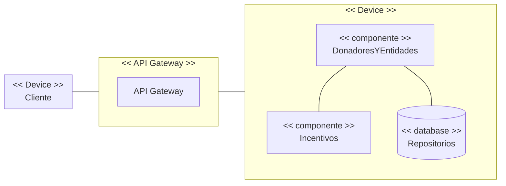

```mermaid
---
config:
  layout: dagre
---
flowchart LR
 subgraph Nodo1["&lt;&lt; Device &gt;&gt;"
      Cliente]
  end
 subgraph Nodo2["&lt;&lt; API Gateway &gt;&gt;"]
        Api["API Gateway"]
  end
 subgraph Nodo3["&lt;&lt; Device &gt;&gt;"]
        DonadoresYEntidades["&lt;&lt; componente &gt;&gt; 
        DonadoresYEntidades"]
        Incentivos["&lt;&lt; componente &gt;&gt; 
        Incentivos"]
        DB[("&lt;&lt; database &gt;&gt; 
        Repositorios")]
  end
    Nodo1 --- Nodo2
    Nodo2 --- Nodo3
    DonadoresYEntidades --- Incentivos
    DonadoresYEntidades --- DB
```
