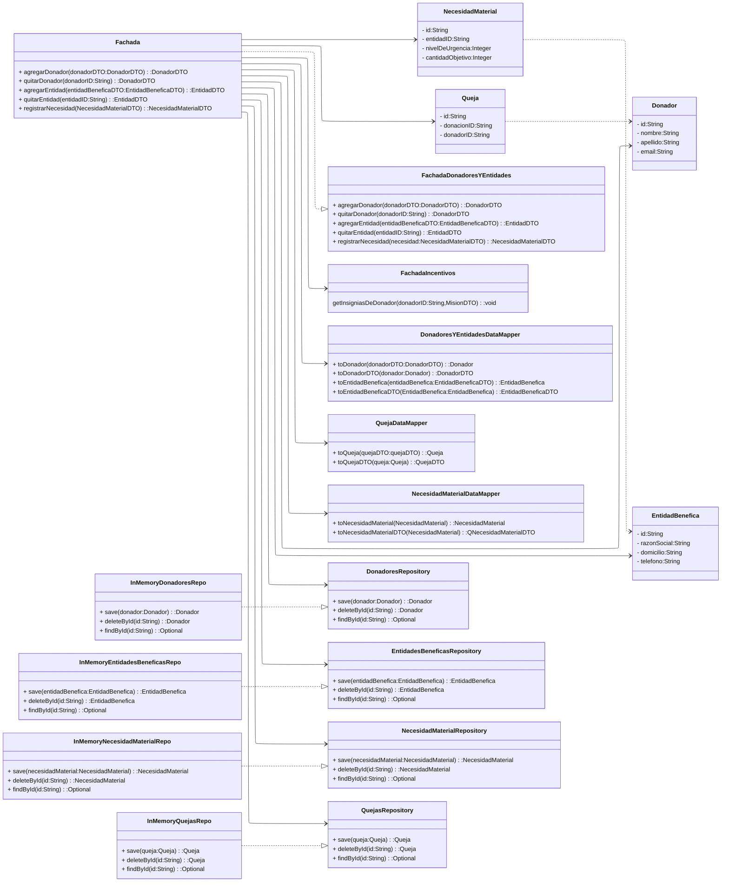

```mermaid
---
config:
  layout: elk
---
classDiagram
direction LR
    class Fachada {
	    + agregarDonador(donadorDTO:DonadorDTO) :DonadorDTO
	    + quitarDonador(donadorID:String) :DonadorDTO
	    + agregarEntidad(entidadBeneficaDTO:EntidadBeneficaDTO) :EntidadDTO
	    + quitarEntidad(entidadID:String) :EntidadDTO
	    + registrarNecesidad(NecesidadMaterialDTO) :NecesidadMaterialDTO
    }

    class Donador {
	    - id:String
	    - nombre:String
	    - apellido:String
	    - email:String
    }

    class EntidadBenefica {
	    - id:String
	    - razonSocial:String
	    - domicilio:String
	    - telefono:String
    }

    class NecesidadMaterial {
	    - id:String
	    - entidadID:String
	    - nivelDeUrgencia:Integer
	    - cantidadObjetivo:Integer
    }

    class Queja {
	    - id:String
	    - donacionID:String
	    - donadorID:String
    }

    class InMemoryDonadoresRepo {
	    + save(donador:Donador) :Donador
	    + deleteById(id:String) :Donador
	    + findById(id:String) :Optional
    }

    class InMemoryEntidadesBeneficasRepo {
	    + save(entidadBenefica:EntidadBenefica) :EntidadBenefica
	    + deleteById(id:String) :EntidadBenefica
	    + findById(id:String) :Optional
    }

    class InMemoryNecesidadMaterialRepo {
	    + save(necesidadMaterial:NecesidadMaterial) :NecesidadMaterial
	    + deleteById(id:String) :NecesidadMaterial
	    + findById(id:String) :Optional
    }

    class InMemoryQuejasRepo {
	    + save(queja:Queja) :Queja
	    + deleteById(id:String) :Queja
	    + findById(id:String) :Optional
    }

    class FachadaDonadoresYEntidades {
	    + agregarDonador(donadorDTO:DonadorDTO) :DonadorDTO
	    + quitarDonador(donadorID:String) :DonadorDTO
	    + agregarEntidad(entidadBeneficaDTO:EntidadBeneficaDTO) :EntidadDTO
	    + quitarEntidad(entidadID:String) :EntidadDTO
	    + registrarNecesidad(necesidad:NecesidadMaterialDTO) :NecesidadMaterialDTO
    }

    class FachadaIncentivos {
	    getInsigniasDeDonador(donadorID:String,MisionDTO) :void
    }

    class DonadoresYEntidadesDataMapper {
	    + toDonador(donadorDTO:DonadorDTO) :Donador
	    + toDonadorDTO(donador:Donador) :DonadorDTO
	    + toEntidadBenefica(entidadBenefica:EntidadBeneficaDTO) :EntidadBenefica
	    + toEntidadBeneficaDTO(EntidadBenefica:EntidadBenefica) :EntidadBeneficaDTO
    }

    class QuejaDataMapper {
	    + toQueja(quejaDTO:quejaDTO) :Queja
	    + toQuejaDTO(queja:Queja) :QuejaDTO
    }

    class NecesidadMaterialDataMapper {
	    + toNecesidadMaterial(NecesidadMaterial) :NecesidadMaterial
	    + toNecesidadMaterialDTO(NecesidadMaterial) :QNecesidadMaterialDTO
    }

    class DonadoresRepository {
	    + save(donador:Donador) :Donador
	    + deleteById(id:String) :Donador
	    + findById(id:String) :Optional
    }

    class EntidadesBeneficasRepository {
	    + save(entidadBenefica:EntidadBenefica) :EntidadBenefica
	    + deleteById(id:String) :EntidadBenefica
	    + findById(id:String) :Optional
    }

    class NecesidadMaterialRepository {
	    + save(necesidadMaterial:NecesidadMaterial) :NecesidadMaterial
	    + deleteById(id:String) :NecesidadMaterial
	    + findById(id:String) :Optional
    }

    class QuejasRepository {
	    + save(queja:Queja) :Queja
	    + deleteById(id:String) :Queja
	    + findById(id:String) :Optional
    }

    Fachada ..|> FachadaDonadoresYEntidades
    Fachada --> Donador
    Fachada --> EntidadBenefica
    Fachada --> NecesidadMaterial
    Fachada --> Queja
    Queja ..> Donador
    NecesidadMaterial ..> EntidadBenefica
    Fachada --> FachadaIncentivos
    Fachada --> DonadoresYEntidadesDataMapper
    Fachada --> QuejaDataMapper
    Fachada --> NecesidadMaterialDataMapper
    Fachada --> DonadoresRepository
    Fachada --> EntidadesBeneficasRepository
    Fachada --> NecesidadMaterialRepository
    Fachada --> QuejasRepository
    InMemoryDonadoresRepo ..|> DonadoresRepository 
    InMemoryEntidadesBeneficasRepo ..|> EntidadesBeneficasRepository
    InMemoryNecesidadMaterialRepo ..|> NecesidadMaterialRepository
    InMemoryQuejasRepo ..|> QuejasRepository
```
